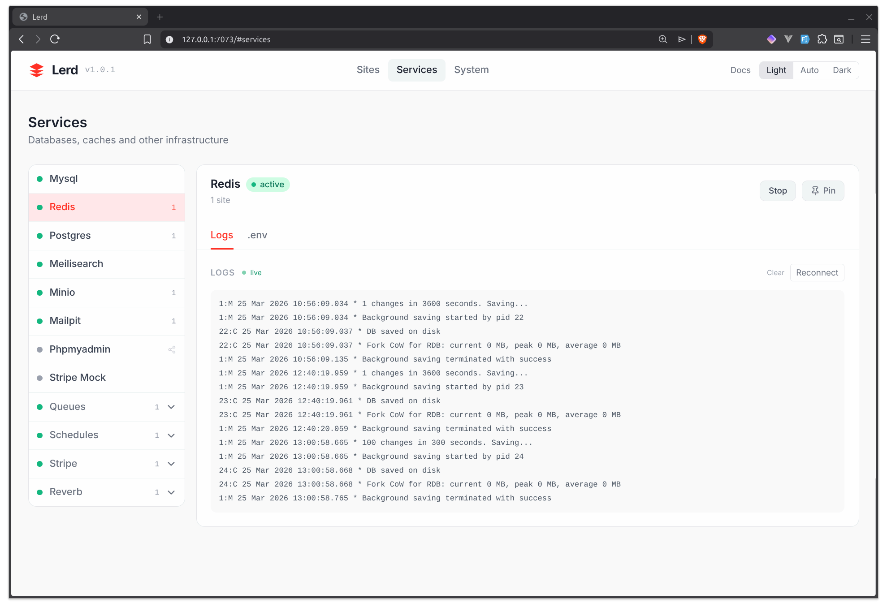
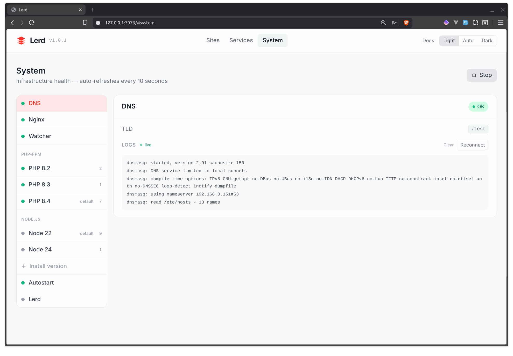

# Lerd

Laravel Herd for Linux — a Podman-native local development environment for Laravel projects.

Lerd bundles Nginx, PHP-FPM, and optional services (MySQL, Redis, PostgreSQL, Meilisearch, MinIO) as rootless Podman containers, giving you automatic `.test` domain routing, per-project PHP/Node version isolation, and one-command TLS — all without touching your system's PHP or web server.

---

## Lerd vs Laravel Sail

[Laravel Sail](https://laravel.com/docs/sail) is the official per-project Docker Compose solution. Lerd is a shared infrastructure approach, closer to what [Laravel Herd](https://herd.laravel.com/) does on macOS. Both are valid — they solve slightly different problems.

| | Lerd | Laravel Sail |
|---|---|---|
| Nginx | One shared container for all sites | Per-project |
| PHP-FPM | One container per PHP version, shared | Per-project container |
| Services (MySQL, Redis…) | One shared instance | Per-project (or manually shared) |
| `.test` domains | Automatic, zero config | Manual `/etc/hosts` or dnsmasq |
| HTTPS | `lerd secure` → trusted cert instantly | Manual or roll your own mkcert |
| RAM with 5 projects running | ~200 MB | ~1–2 GB (5× stacks) |
| Requires changes to project files | No | Yes — needs `docker-compose.yml` committed |
| Works on legacy / client repos | Yes — just `lerd link` | Only if you can add Sail |
| Defined in code (infra-as-code) | No | Yes |
| Team parity (all OS) | Linux only | macOS, Windows, Linux |

**Choose Sail when:** your team uses it, you need per-project service versions, or you want infrastructure defined in the repo.

**Choose Lerd when:** you work across many projects at once and don't want a separate stack per repo, you can't modify project files, you want instant `.test` routing, or you're on Linux and want the Herd experience.

---

## Requirements

- Linux (Arch, Debian/Ubuntu, or Fedora-based)
- [Podman](https://podman.io/) (rootless, with systemd user session active)
- [NetworkManager](https://networkmanager.dev/) (for `.test` DNS)
- `systemctl --user` functional (`loginctl enable-linger $USER` if needed)
- `unzip` (used during install to extract fnm)
- `certutil` / `nss-tools` (for mkcert to install the CA into Chrome/Firefox — `nss` on Arch, `libnss3-tools` on Debian/Ubuntu, `nss-tools` on Fedora)

Go is only needed to build from source. The released binary has no runtime dependencies.

---

## Installation

### One-line installer (recommended)

With curl:

```bash
curl -fsSL https://raw.githubusercontent.com/geodro/lerd/main/install.sh | bash
```

With wget:

```bash
wget -qO- https://raw.githubusercontent.com/geodro/lerd/main/install.sh | bash
```

This will:
- Check and offer to install missing prerequisites (Podman, NetworkManager, unzip)
- Download the latest `lerd` binary for your architecture (amd64 / arm64)
- Install it to `~/.local/bin/lerd`
- Add `~/.local/bin` to your shell's `PATH` (bash, zsh, or fish)
- Automatically run `lerd install` to complete environment setup

> **DNS setup:** `lerd install` writes to `/etc/NetworkManager/dnsmasq.d/` and `/etc/NetworkManager/conf.d/` and restarts NetworkManager. This is the only step that requires `sudo`.

After install, reload your shell or open a new terminal so `PATH` takes effect.

### Install from a local build

If you built from source and want to skip the GitHub download:

```bash
make build
bash install.sh --local ./build/lerd
```

### Update

```bash
lerd update
```

Fetches the latest release from GitHub, downloads the binary for your architecture, and atomically replaces the running binary. No restart needed.

You can also re-run the installer:

```bash
curl -fsSL https://raw.githubusercontent.com/geodro/lerd/main/install.sh | bash -s -- --update
```

```bash
wget -qO- https://raw.githubusercontent.com/geodro/lerd/main/install.sh | bash -s -- --update
```

### Uninstall

```bash
lerd uninstall
```

Stops all containers, disables and removes Quadlet units, removes the watcher service, removes the binary, and cleans up the `PATH` entry from your shell config. Prompts before deleting config and data directories.

To skip all prompts:

```bash
lerd uninstall --force
```

### Check prerequisites only

```bash
bash install.sh --check
```

### From source

```bash
git clone https://github.com/geodro/lerd
cd lerd
make build
make install            # installs to ~/.local/bin/lerd
make install-installer  # installs lerd-installer to ~/.local/bin/
```

`lerd install` will:

1. Create XDG config and data directories
2. Create the `lerd` Podman network
3. Download static binaries: Composer, fnm, mkcert
4. Install the mkcert CA into your system trust store
5. Write and start the `lerd-dns` and `lerd-nginx` Podman Quadlet containers
6. Enable the `lerd-watcher` background service (auto-discovers new projects)
7. Add `~/.local/share/lerd/bin` to your shell's `PATH`

---

## Quick start

```bash
# 1. Park your projects directory — any Laravel project inside is auto-registered
lerd park ~/Lerd

# 2. Visit your project in a browser
#    ~/Lerd/my-app  →  http://my-app.test

# 3. Check everything is running
lerd status
```

That's it. Nginx is serving your project through PHP-FPM, all inside Podman containers on the `lerd` network.

---

## Web UI

Lerd includes a browser dashboard, served at **`http://127.0.0.1:7073`** by the `lerd-ui` systemd service (started automatically with `lerd install`).





The UI gives you a visual overview of your entire Lerd environment without touching the terminal:

- **Sites tab** — lists all registered projects with their domain, path, PHP version, Node version, and per-site controls:
  - **HTTPS toggle** — enable or disable TLS with one click; updates `APP_URL` in `.env` automatically
  - **PHP / Node dropdowns** — change the version per site; writes `.php-version` / `.node-version` into the project and regenerates the nginx vhost on the fly
  - **Queue toggle** — start or stop the Laravel queue worker for a site; amber when running; click the **logs** link next to the toggle to open the live log drawer for that worker
  - **Unlink button** — remove a site from nginx without touching the terminal; for parked sites the directory is left on disk (run `lerd link` to re-register it)
  - **Click any row** — opens the live PHP-FPM log drawer at the bottom of the screen
- **Services tab** — shows all available services (MySQL, Redis, PostgreSQL, Meilisearch, MinIO, Mailpit, Soketi) with their current status. Start or stop any service with one click; each panel shows the correct `.env` connection values with a one-click copy button.
- **System tab** — health check panel for DNS, nginx, PHP-FPM containers, and the autostart toggle.
- **Updates** — shows the current and latest version. When an update is available, a notice with the version number is shown alongside an instruction to run `lerd update` in a terminal (the update requires `sudo` for sysctl/sudoers steps and cannot run in the background).

---

## System Tray

`lerd tray` launches a system tray applet that gives you at-a-glance status and one-click control without opening a browser.

```bash
lerd tray              # launch (detaches from terminal automatically)
lerd tray --mono=false # use the red colour icon instead of monochrome white
```

The tray detaches from the terminal immediately — your shell prompt returns straight away.

### Menu layout

```
🟢 Running          ← overall status (disabled, informational)
  🟢 nginx
  🟢 dns
─────────────────
Open Dashboard       ← opens http://127.0.0.1:7073
Stop Lerd            ← toggles between Start / Stop Lerd
─────────────────
── Services ──
  🟢 mysql           ← click to stop
  🔴 redis           ← click to start
─────────────────
── PHP ──
  ✔ 8.4              ← current default (click to switch)
  8.3
─────────────────
Autostart at login: ✔ On   ← click to toggle
Check for update...
Stop Lerd & Quit     ← runs lerd stop then exits the tray
```

The menu refreshes every 5 seconds. Clicking a service toggles it on/off. Clicking a PHP version sets it as the global default. "Stop Lerd & Quit" stops the entire environment before closing.

### Autostart

To have the tray start automatically when you log in:

```bash
lerd autostart tray enable
lerd autostart tray disable
```

The tray is also started automatically by `lerd start` if it isn't already running.

### Desktop environment compatibility

The tray uses the **StatusNotifierItem (SNI) / AppIndicator** protocol (DBus-based).

| Environment | Status |
|---|---|
| KDE Plasma | Works out of the box |
| GNOME | Requires the [AppIndicator and KStatusNotifierItem Support](https://extensions.gnome.org/extension/615/appindicator-support/) extension |
| Sway / Hyprland with waybar | Works with `"tray"` module in waybar config |
| i3 with i3bar | Requires [snixembed](https://git.sr.ht/~yerlan/snixembed) to bridge SNI → XEmbed |
| XFCE / LXQt | Works out of the box |

### Build requirements

The tray uses CGO and requires `libappindicator3` at build time:

| Distro | Package |
|---|---|
| Arch | `libappindicator-gtk3` |
| Debian / Ubuntu | `libappindicator3-dev` |
| Fedora | `libappindicator-gtk3-devel` |

For headless / CI builds without AppIndicator:

```bash
make build-nogui   # produces ./build/lerd-nogui — lerd tray returns an error
```

---

## Commands

### Setup & lifecycle

| Command | Description |
|---|---|
| `lerd install` | One-time setup: directories, network, binaries, DNS, nginx, watcher |
| `lerd start` | Start DNS, nginx, PHP-FPM containers, and all installed services |
| `lerd stop` | Stop DNS, nginx, PHP-FPM containers, and all running services |
| `lerd update` | Update to the latest release |
| `lerd uninstall` | Stop all containers and remove Lerd |
| `lerd uninstall --force` | Same, skipping all confirmation prompts |
| `lerd autostart enable` | Start Lerd automatically on every login |
| `lerd autostart disable` | Disable autostart on login |
| `lerd tray` | Launch the system tray applet (detaches from terminal) |
| `lerd autostart tray enable` | Start the tray applet automatically on graphical login |
| `lerd autostart tray disable` | Disable tray autostart |
| `lerd dns:check` | Verify that `*.test` resolves to `127.0.0.1` |
| `lerd status` | Health summary: DNS, nginx, PHP-FPM containers, services, cert expiry |
| `lerd logs [-f] [target]` | Show logs for the current project's FPM container, `nginx`, a service name, or a PHP version |

### Project setup

| Command | Description |
|---|---|
| `lerd setup` | Interactive project bootstrap — checkbox list of steps to run in sequence |
| `lerd setup --all` | Run all setup steps without prompting (useful in CI) |
| `lerd setup --skip-open` | Same as above but don't open the browser at the end |

### Site management

| Command | Description |
|---|---|
| `lerd park [dir]` | Register all Laravel projects inside `dir` (defaults to cwd) |
| `lerd unpark [dir]` | Remove a parked directory and unlink all its sites |
| `lerd link [name]` | Register the current directory as a site |
| `lerd link [name] --domain foo.test` | Register with a custom domain |
| `lerd unlink [name]` | Stop serving the site; for parked dirs keeps the registry entry so the watcher won't re-register it |
| `lerd sites` | Table view of all registered sites |
| `lerd open [name]` | Open the site in the default browser |
| `lerd share [name]` | Expose the site publicly via ngrok or Expose (auto-detected) |
| `lerd secure [name]` | Issue a mkcert TLS cert and enable HTTPS for a site — updates `APP_URL` in `.env` |
| `lerd unsecure [name]` | Remove TLS and switch back to HTTP — updates `APP_URL` in `.env` |
| `lerd env` | Configure `.env` for the current project with lerd service connection settings |

> **Domain naming:** directories with real TLDs are automatically normalised — dots are replaced with dashes and the TLD is stripped before appending `.test`. For example `admin.astrolov.com` → `admin-astrolov.test`.

> **Unlink behaviour for parked sites:** when you unlink a site that lives inside a parked directory, the vhost is removed but the registry entry is kept and marked as *ignored* — the watcher will not re-register it on its next scan. Running `lerd link` in that directory clears the ignored flag and restores the site.

### PHP

| Command | Description |
|---|---|
| `lerd use <version>` | Set the global PHP version and build the FPM image if needed |
| `lerd isolate <version>` | Pin PHP version for cwd — writes `.php-version` |
| `lerd php:list` | List all installed PHP-FPM versions |
| `lerd php:rebuild` | Force-rebuild all installed PHP-FPM images (run after `lerd update` if needed) |
| `lerd fetch [version...]` | Pre-build PHP FPM images for the given (or all supported) versions so first use isn't slow |
| `lerd php [args...]` | Run PHP in the project's container |
| `lerd artisan [args...]` | Run `php artisan` in the project's container |
| `lerd xdebug on [version]` | Enable Xdebug for a PHP version — rebuilds the FPM image and restarts the container |
| `lerd xdebug off [version]` | Disable Xdebug — rebuilds without Xdebug and restarts |
| `lerd xdebug status` | Show Xdebug enabled/disabled for all installed PHP versions |

If no version is given, the version is resolved from the current directory (`.php-version` or `composer.json`, falling back to the global default).

Xdebug is configured with:
- `xdebug.mode=debug`
- `xdebug.start_with_request=yes`
- `xdebug.client_host=host.containers.internal` (reaches your host IDE from the container)
- `xdebug.client_port=9003`

### Node

| Command | Description |
|---|---|
| `lerd isolate:node <version>` | Pin Node version for cwd — writes `.node-version`, runs `fnm install` |
| `lerd node [args...]` | Run node using the project's version via fnm |
| `lerd npm [args...]` | Run npm using the project's version via fnm |
| `lerd npx [args...]` | Run npx using the project's version via fnm |

### Services

| Command | Description |
|---|---|
| `lerd service start <name>` | Start a service (auto-installs on first use) |
| `lerd service stop <name>` | Stop a service container |
| `lerd service restart <name>` | Restart a service container |
| `lerd service status <name>` | Show systemd unit status |
| `lerd service list` | Show all services and their current state |

Available services: `mysql`, `redis`, `postgres`, `meilisearch`, `minio`, `mailpit`, `soketi`.

### Database shortcuts

Reads `DB_CONNECTION`, `DB_DATABASE`, `DB_USERNAME`, and `DB_PASSWORD` from the project's `.env` and runs the appropriate command inside the service container.

| Command | Description |
|---|---|
| `lerd db:create [name]` | Create a database and a `<name>_testing` database for the current project |
| `lerd db:import <file.sql>` | Import a SQL dump into the current site's database |
| `lerd db:export [-o file.sql]` | Export the current site's database (defaults to `<database>.sql`) |
| `lerd db:shell` | Open an interactive MySQL or PostgreSQL shell for the current project |
| `lerd db create [name]` | Same as `db:create` (subcommand form) |
| `lerd db import <file.sql>` | Same as `db:import` (subcommand form) |
| `lerd db export` | Same as `db:export` (subcommand form) |
| `lerd db shell` | Same as `db:shell` (subcommand form) |

**`lerd db:create` name resolution** (first match wins):
1. Explicit `[name]` argument
2. `DB_DATABASE` from the project's `.env`
3. Project name derived from the registered site name (or directory name)

A `<name>_testing` database is always created alongside the main one. If a database already exists the command reports it instead of failing.

Supports `DB_CONNECTION=mysql` / `mariadb` (via `lerd-mysql`) and `pgsql` / `postgres` (via `lerd-postgres`).

### Sharing sites

`lerd share` exposes the current site via a public tunnel. Requires [ngrok](https://ngrok.com/download) or [Expose](https://expose.dev) to be installed.

| Command | Description |
|---|---|
| `lerd share` | Share the current site (auto-detects ngrok or Expose) |
| `lerd share <name>` | Share a named site |
| `lerd share --ngrok` | Force ngrok |
| `lerd share --expose` | Force Expose |

The tunnel forwards to nginx's local port with the site's domain as the `Host` header, so nginx routes the request to the right vhost even though the incoming request has the public tunnel URL as its host.

### Queue workers

Lerd can run Laravel queue workers as persistent systemd user services. The worker runs `php artisan queue:work` inside the project's PHP-FPM container and restarts automatically on failure.

| Command | Description |
|---|---|
| `lerd queue:start` | Start a queue worker for the current project |
| `lerd queue:stop` | Stop the queue worker for the current project |
| `lerd queue start` | Same as `queue:start` (subcommand form) |
| `lerd queue stop` | Same as `queue:stop` (subcommand form) |

Options for `queue:start`:

| Flag | Default | Description |
|---|---|---|
| `--queue` | `default` | Queue name to process |
| `--tries` | `3` | Max attempts before marking a job as failed |
| `--timeout` | `60` | Seconds a job may run before timing out |

Example:

```bash
cd ~/Lerd/my-app
lerd queue:start --queue=emails,default --tries=5 --timeout=120
# Systemd unit: lerd-queue-my-app.service
# Logs: journalctl --user -u lerd-queue-my-app -f
```

Queue workers are also controllable from the **Sites tab** in the web UI — the amber toggle starts/stops the worker and the **logs** link opens a live log drawer in the browser.

### Shell completion

```bash
lerd completion bash   # add to ~/.bashrc
lerd completion zsh    # add to ~/.zshrc
lerd completion fish   # add to ~/.config/fish/completions/lerd.fish
```

---

## PHP version resolution

When serving a request, Lerd picks the PHP version for a project in this order:

1. `.lerd.yaml` in the project root — `php_version` field (explicit lerd override)
2. `composer.json` — `require.php` constraint (e.g. `^8.4` → `8.4`)
3. `.php-version` file in the project root (plain text, e.g. `8.2`)
4. Global default in `~/.config/lerd/config.yaml`

To pin a project permanently:

```bash
cd ~/Lerd/my-app
lerd isolate 8.2
# writes .php-version: 8.2 — commit this if you like
```

To change the global default:

```bash
lerd use 8.4
```

---

## Node version resolution

1. `.nvmrc` in the project root
2. `.node-version` in the project root
3. `package.json` — `engines.node` field
4. Global default in `~/.config/lerd/config.yaml`

To pin a project:

```bash
cd ~/Lerd/my-app
lerd isolate:node 20
# writes .node-version and runs: fnm install 20
```

---

## HTTPS / TLS

Lerd uses [mkcert](https://github.com/FiloSottile/mkcert) — a locally-trusted CA that your browser will accept without warnings.

```bash
cd ~/Lerd/my-app
lerd secure
# Issues a cert for my-app.test, regenerates the SSL vhost, reloads nginx
# Updates APP_URL=https://my-app.test in .env if it exists
# Visit https://my-app.test — no certificate warning

lerd unsecure
# Removes the cert, switches back to HTTP vhost
# Updates APP_URL=http://my-app.test in .env if it exists
```

Certificates are stored in `~/.local/share/lerd/certs/sites/`.

---

## Project bootstrap — `lerd setup`

`lerd setup` automates the standard steps for getting a fresh Laravel clone running locally. Run it from the project root:

```bash
cd ~/Projects/my-app
lerd setup
```

A checkbox list appears with all available steps pre-selected based on the current project state. Toggle steps with space, confirm with enter, then watch them run sequentially.

```
→ Registering site...
Linked: my-app -> my-app.test (PHP 8.4, Node 24)

? Select setup steps to run:
  ◉ composer install
  ◉ npm ci
  ◉ lerd env
  ◯ lerd mcp:inject
  ◉ php artisan migrate
  ◯ php artisan db:seed
  ◉ npm run build
  ◯ lerd secure
  ◉ lerd open
```

**`lerd link` always runs first** (before the checkbox UI appears) to ensure the site is registered with the correct PHP version. This is mandatory — it handles both freshly cloned projects and projects already auto-registered by a parked directory.

**Smart defaults:**

| Step | Default | Condition |
|---|---|---|
| `composer install` | ✅ on | only if `vendor/` is missing |
| `npm ci` | ✅ on | only if `node_modules/` is missing and `package.json` exists |
| `lerd env` | ✅ on | always |
| `lerd mcp:inject` | ☐ off | opt-in |
| `php artisan migrate` | ✅ on | always |
| `php artisan db:seed` | ☐ off | opt-in |
| `npm run build` | ✅ on | only if `package.json` exists |
| `lerd secure` | ☐ off | opt-in |
| `lerd open` | ✅ on | always |

If a step fails, you are prompted to continue or abort:

```
✗ migrate failed: exit status 1
  Continue with remaining steps? [y/N]:
```

**Flags:**

| Flag | Description |
|---|---|
| `--all` / `-a` | Select all steps without showing the prompt (CI/automation) |
| `--skip-open` | Skip opening the browser at the end |

---

## Environment setup — `lerd env`

`lerd env` sets up the `.env` file for a Laravel project in one command:

```bash
cd ~/Lerd/my-app
lerd env
```

What it does:

1. **Creates `.env`** from `.env.example` if no `.env` exists yet
2. **Detects which services the project uses** by inspecting the existing env keys — `DB_CONNECTION`, `REDIS_HOST`, `MAIL_HOST`, `SCOUT_DRIVER`, `FILESYSTEM_DISK`, `BROADCAST_CONNECTION`, etc.
3. **Writes lerd connection values** for each detected service (hosts, ports, credentials) — preserving all comments and line order
4. **Creates the project database** (and a `<name>_testing` database) inside the running service container; reports if they already exist
5. **Starts any referenced service** that is not already running
6. **Sets `APP_URL`** to the project's registered `.test` domain (`https://` if secured, `http://` otherwise)
7. **Generates `APP_KEY`** via `php artisan key:generate` if the key is missing or empty

Example output:

```
Creating .env from .env.example...
  Detected mysql        — applying lerd connection values
  Detected redis        — applying lerd connection values
  Detected mailpit      — applying lerd connection values
  Setting APP_URL=http://my-app.test
  Generating APP_KEY...
Done.
```

Running `lerd env` on a project that already has a `.env` is safe — it only updates connection-related keys and leaves everything else untouched.

---

## AI assistant integration (MCP)

Lerd ships a [Model Context Protocol](https://modelcontextprotocol.io/) server, letting AI assistants (Claude Code, JetBrains Junie, and any other MCP-compatible tool) manage your dev environment directly — run migrations, start services, toggle queue workers, and inspect logs without leaving the chat.

### Injecting the config

Run this once from a Laravel project root:

```bash
cd ~/Lerd/my-app
lerd mcp:inject
```

This writes three files:

| File | Purpose |
|---|---|
| `.mcp.json` | MCP server entry for Claude Code |
| `.claude/skills/lerd/SKILL.md` | Skill file that teaches Claude about lerd tools |
| `.junie/mcp/mcp.json` | MCP server entry for JetBrains Junie |

The command **merges** into existing configs — other MCP servers (e.g. `laravel-boost`, `herd`) are left untouched. Re-running it is safe.

To target a different directory:

```bash
lerd mcp:inject --path ~/Lerd/another-app
```

### Available MCP tools

Once the MCP server is connected, your AI assistant has access to:

| Tool | Description |
|---|---|
| `sites` | List all registered lerd sites (name, domain, path, PHP version, queue status) |
| `artisan` | Run `php artisan` in the PHP-FPM container — migrations, generators, seeders, cache, tinker |
| `service_start` | Start an infrastructure service (mysql, redis, postgres, …) |
| `service_stop` | Stop a service |
| `queue_start` | Start a queue worker for a site |
| `queue_stop` | Stop a queue worker |
| `logs` | Fetch recent container logs (nginx, any service, PHP version, or site name) |

### Example interactions

```
You: run migrations for the whitewaters project
AI:  → sites()           # finds path /home/user/Lerd/whitewaters
     → artisan(path: "/home/user/Lerd/whitewaters", args: ["migrate"])
     ✓  Ran 3 migrations in 42ms

You: the app is throwing 500s — check the logs
AI:  → logs(target: "8.4", lines: 50)
     PHP Fatal error: Class "App\Jobs\ProcessOrder" not found ...
```

---

## Configuration

### Global config — `~/.config/lerd/config.yaml`

Created automatically on first run with sensible defaults:

```yaml
php:
  default_version: "8.5"
node:
  default_version: "22"
nginx:
  http_port: 80
  https_port: 443
dns:
  tld: "test"
parked_directories:
  - ~/Lerd
services:
  mysql:       { enabled: true,  image: "mysql:8.0",                    port: 3306 }
  redis:       { enabled: true,  image: "redis:7-alpine",               port: 6379 }
  postgres:    { enabled: false, image: "postgres:16-alpine",           port: 5432 }
  meilisearch: { enabled: false, image: "getmeili/meilisearch:v1.7",    port: 7700 }
  minio:       { enabled: false, image: "minio/minio:latest",           port: 9000 }
  mailpit:     { enabled: false, image: "axllent/mailpit:latest",       port: 1025 }
  soketi:      { enabled: false, image: "quay.io/soketi/soketi:latest-16-alpine", port: 6001 }
```

### Per-project config — `.lerd.yaml`

Optional file in a project root to override site settings:

```yaml
php_version: "8.2"
node_version: "18"
domain: "my-app.test"   # override the auto-generated domain
secure: true
```

---

## Directory layout

```
~/.config/lerd/
└── config.yaml

~/.config/containers/systemd/        # Podman Quadlet units (auto-loaded)
~/.config/systemd/user/
└── lerd-watcher.service

~/.local/share/lerd/
├── bin/                             # mkcert, fnm, static PHP binaries
├── nginx/
│   ├── nginx.conf
│   ├── conf.d/                      # one .conf per site (auto-generated)
│   └── logs/
├── certs/
│   ├── ca/
│   └── sites/                       # per-domain .crt + .key
├── data/                            # Podman volume bind-mounts
│   ├── mysql/
│   ├── redis/
│   ├── postgres/
│   ├── meilisearch/
│   └── minio/
├── dnsmasq/
│   └── lerd.conf
└── sites.yaml
```

---

## Architecture

All containers join the rootless Podman network `lerd`. Communication between Nginx and PHP-FPM uses container names as hostnames:

```
Browser → 127.0.0.1:80 → lerd-nginx
                              └─ fastcgi_pass lerd-php84-fpm:9000
                                     └─ lerd-php84-fpm (mounts ~/Lerd read-only)

*.test → DNS → 127.0.0.1
                   └─ lerd-dns (dnsmasq, host network, port 5300)
                        ← NetworkManager forwards .test queries here
```

| Component | Technology |
|---|---|
| CLI | Go + Cobra, single static binary |
| Web server | Podman Quadlet — `nginx:alpine` |
| PHP-FPM | Podman Quadlet per version — locally built image with all Laravel extensions |
| PHP CLI | `php` binary inside the FPM container (`podman exec`) |
| Composer | `composer.phar` via bundled PHP CLI |
| Node | [fnm](https://github.com/Schniz/fnm) binary, version per project |
| Services | Podman Quadlet containers |
| DNS | dnsmasq container + NetworkManager integration |
| TLS | [mkcert](https://github.com/FiloSottile/mkcert) — locally trusted CA |

---

## Building

The default build requires CGO and `libappindicator3` for the system tray (see [Build requirements](#build-requirements) above).

```bash
make build      # → ./build/lerd  (CGO, with tray support)
make build-nogui # → ./build/lerd-nogui  (no CGO, no tray)
make install    # build + install to ~/.local/bin/lerd
make test       # go test ./...
make clean      # remove ./build/
```

Cross-compile for arm64 (without tray):

```bash
CGO_ENABLED=0 GOARCH=arm64 GOOS=linux go build -tags nogui -o ./build/lerd-arm64 ./cmd/lerd
```

---

## Service credentials (defaults)

Services run as Podman containers on the `lerd` network. Two sets of hostnames apply:

- **From host tools** (e.g. TablePlus, Redis CLI): use `127.0.0.1`
- **From your Laravel app** (PHP-FPM runs inside the `lerd` network): use container hostnames (e.g. `lerd-mysql`)

`lerd service start <name>` prints the correct `.env` variables to paste into your project.

| Service | Host (host tools) | Host (Laravel `.env`) | Port | User | Password | DB |
|---|---|---|---|---|---|---|
| MySQL | 127.0.0.1 | lerd-mysql | 3306 | root | `lerd` | `lerd` |
| PostgreSQL | 127.0.0.1 | lerd-postgres | 5432 | postgres | `lerd` | `lerd` |
| Redis | 127.0.0.1 | lerd-redis | 6379 | — | — | — |
| Meilisearch | 127.0.0.1 | lerd-meilisearch | 7700 | — | — | — |
| MinIO | 127.0.0.1 | lerd-minio | 9000 | `lerd` | `lerdpassword` | — |
| Mailpit SMTP | 127.0.0.1 | lerd-mailpit | 1025 | — | — | — |
| Soketi | 127.0.0.1 | lerd-soketi | 6001 | — | — | — |

MinIO console is available at `http://127.0.0.1:9001`.

Mailpit web UI is available at `http://127.0.0.1:8025`.

Soketi metrics are available at `http://127.0.0.1:9601`.

---

## Troubleshooting

**`.test` domains not resolving**

```bash
lerd dns:check
# If it fails:
sudo systemctl restart NetworkManager
lerd dns:check
```

**Nginx not serving a site**

```bash
lerd status                         # check nginx and FPM are running
podman logs lerd-nginx              # nginx error log
cat ~/.local/share/lerd/nginx/conf.d/my-app.test.conf   # check generated vhost
```

**PHP-FPM container not running**

```bash
systemctl --user status lerd-php84-fpm
systemctl --user start lerd-php84-fpm
podman logs lerd-php84-fpm
```

**Permission denied on port 80/443**

Rootless Podman cannot bind to ports below 1024 by default. Allow it:

```bash
sudo sysctl -w net.ipv4.ip_unprivileged_port_start=80
# Make permanent:
echo 'net.ipv4.ip_unprivileged_port_start=80' | sudo tee /etc/sysctl.d/99-lerd.conf
```

**Watcher service not running**

```bash
systemctl --user status lerd-watcher
systemctl --user start lerd-watcher
```
