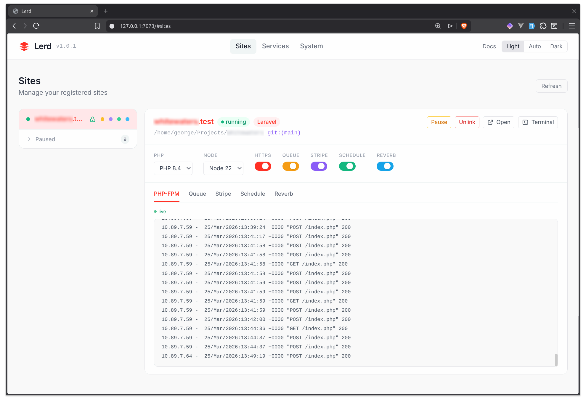

# Lerd

> The open-source Laravel Herd alternative for Linux —
> Podman-native, rootless, with a built-in web UI.

[](https://github.com/geodro/lerd/actions/workflows/ci.yml)
[](https://github.com/geodro/lerd/releases)
[](LICENSE)
[]()
[](https://geodro.github.io/lerd/)



Lerd runs Nginx, PHP-FPM, and your services as rootless Podman containers.
No Docker. No sudo. No system pollution. Just `lerd link` and your project
is live at `project.test` with HTTPS.

## Features

- 🌐 **Automatic `.test` domains** with one-command TLS
- 🐘 **Per-project PHP version** (8.2, 8.3, 8.4), switch with one click
- 📦 **Node.js isolation** per project (Node 22, 24)
- 🖥️ **Built-in Web UI** - manage sites, services, and logs from a browser
- 🗄️ **One-click services**: MySQL, PostgreSQL, Redis, Meilisearch, Minio, Mailpit, Stripe Mock, Reverb and more
- 📋 **Live logs** for PHP-FPM, Queue, Schedule, Reverb, per site
- 🔒 **Rootless & daemonless** - Podman-native, no Docker required
- 🤖 **MCP server** - let AI assistants (Claude Code, Windsurf, Junie) manage your environment directly
- ⚡ **Laravel-first**, with Symfony, WordPress, and custom framework support

## AI Integration (MCP)

Lerd ships a built-in [Model Context Protocol](https://modelcontextprotocol.io/) server. Connect it to Claude Code, Windsurf, JetBrains Junie, or any MCP-compatible AI assistant and manage your dev environment without leaving the chat.

```bash
lerd mcp:enable-global   # register once, works in every project
```

Then just ask:

```
You: set up the project I just cloned
AI:  → site_link()
     → env_setup()    # detects MySQL + Redis, starts them, creates DB, generates APP_KEY
     → composer install
     → artisan migrate --seed
     ✓  myapp → https://myapp.test ready
```

50+ tools available: run migrations, manage services, toggle workers, tail logs, enable Xdebug, export databases, and more, all from your AI assistant.

📖 [MCP documentation](https://geodro.github.io/lerd/features/mcp/)

## Why Lerd?

|                    | Lerd | DDEV | Lando | Laravel Herd |
|--------------------|------|------|-------|--------------|
| Podman-native      | ✅   | ❌   | ❌    | ❌           |
| Rootless           | ✅   | ❌   | ❌    | ✅           |
| Web UI             | ✅   | ❌   | ❌    | ✅           |
| Linux              | ✅   | ✅   | ✅    | ❌           |
| macOS              | 🔜   | ✅   | ✅    | ✅           |
| MCP server         | ✅   | ❌   | ❌    | ❌           |
| Free & open source | ✅   | ✅   | ✅    | ❌           |

## Install

```bash
curl -fsSL https://raw.githubusercontent.com/geodro/lerd/main/install.sh | bash
```

## Quick Start

```bash
cd my-laravel-project
lerd link
# → https://my-laravel-project.test
```

## Documentation

📖 **[geodro.github.io/lerd](https://geodro.github.io/lerd/)**

- [Requirements](https://geodro.github.io/lerd/getting-started/requirements/)
- [Installation](https://geodro.github.io/lerd/getting-started/installation/)
- [Quick Start](https://geodro.github.io/lerd/getting-started/quick-start/)
- [Services](https://geodro.github.io/lerd/usage/services/)
- [Command Reference](https://geodro.github.io/lerd/reference/commands/)

## License

MIT
